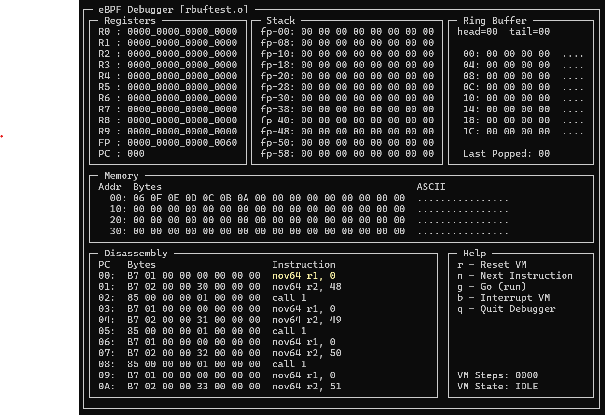

# eBPF101
User-space eBPF Interpreter and debugger for learning.

- [x] Implement the Insn (decoded instruction).
- [x] Implement the eBPF VM.
- [x] Implement the ability to read the bpf ELF.
- [x] Implement the disasm module to translate eBPF bytecodes into strings.
- [x] Implement the Debugger using curses for UI.
- [x] Implement the simple ring-buffer for "user-space" communication.
- [ ] Implement the various test programs to validate functionality.

Author: M. Tim Jones / mtj@mtjones.com

## Motivation
This was written for the 2025 eBPF Summit: Hackathon Edition.

## Introduction
My goal was to implement a simple lab for the visualization of eBPF programs.
This will allow the user to compile a C program into eBPF instructions for 
debugging using clang.

## Debugger Display



## What's Implemented
- Subset of the eBPF instruction set (but enough for most eBPF programs).
- Small local memory.
- Byte-based ring-buffer.
- Real-time and Single-Step execution.
- Visualization of instructions, memory, registers, stack, and ring-buffer.

## Architecture

This implementation is made up of 6 modules.

- Debugger (debugger.py)
- bpfelf (bpfelf.py)
- VM/Interpreter (ebpf.py)
- Ring Buffer (ringbuf.py)
- Instruction class (insn.py)
- Disassembler (disasm.py)

The debugger implements the UI for the eBPF system.  It uses bpfelf to read the ELF
file and identify the instructions (.text section).  It also relies on the VM which
implements the eBPF interpreter, registers, stack, and memory.  The VM uses ringbuf
for a simple ring-buffer implementation (byte, instead of traditional pointer/length
messages).  The VM finally relies on insn which implements the instruction decoder
(into the various field parts of eBPF instructions).  This uses the disasm module
to translate eBPF bytes into text-based instructions for human consumption.

```
                            +----------+
                            |          |
                            | Debugger |
                            |          |
                            +----------+
                               |    |
                         +-----+    +-----+
                         |                |
                   +----------+       +----------+
                   |          |       |          |
                   |  bpfelf  |       |    VM    |
                   |          |       |          |
                   +----------+       +----------+
                                         |    |
                                   +-----+    +-----+
                                   |                |
                             +----------+       +----------+
                             |          |       |          |
                             | ringbuf  |       |   insn   |
                             |          |       |          |
                             +----------+       +----------+
                                                    |
                                                +----------+
                                                |          |
                                                |  disasm  |
                                                |          |
                                                +----------+
```

## Compiling C Programs for the Debugger

Clang is used for compilation of C programs into eBPF instructions.  The bpfelf module
uses the object file to search for instructions (.text section) and load them into 
instruction memory.  This means that to use the call instruction, "asm" or inline assembly
is used (see rbuftest.c).  Here's a typical command-line for compilation:
```
clang -c -target bpf test.c
```
This typically results in a larger object, but can be reduced through optimization:
```
clang -O2 -c -target bpf test.c
```

## Running an Object

To load an object into the debugger, simply include it on the command-line:
```
python3 debugger.py test.o
```
This executes the debugger and loads the object into the instruction memory.

Note that you can also load the data memory usable by the eBPF program as:
```
python3 debugger.py sort.o --mem-hex sortdata.txt
```
The sortdata.txt file contains ASCII-HEX bytes which are loaded into data memory
starting at offset 0.  See sortdata.txt for an example.

